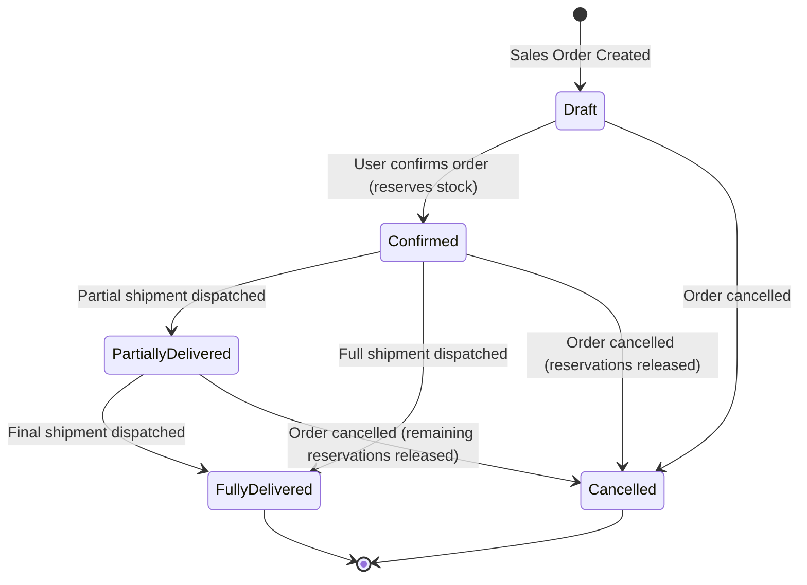
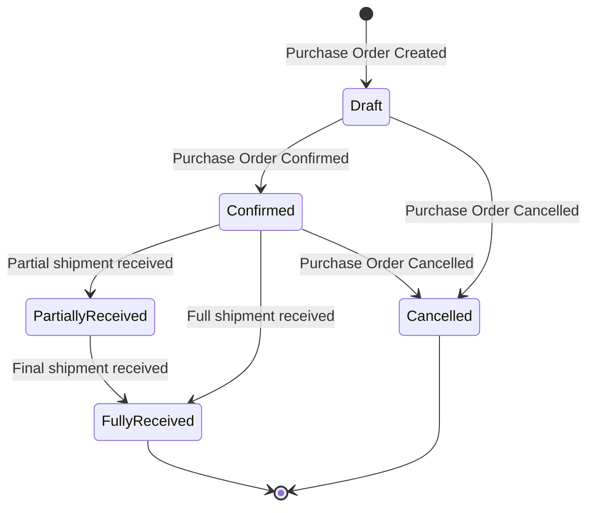
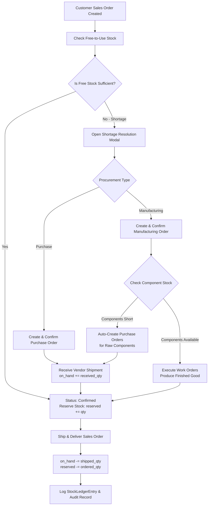
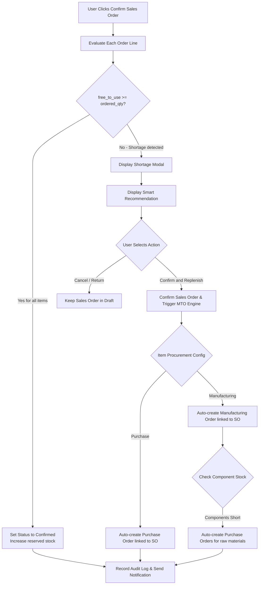
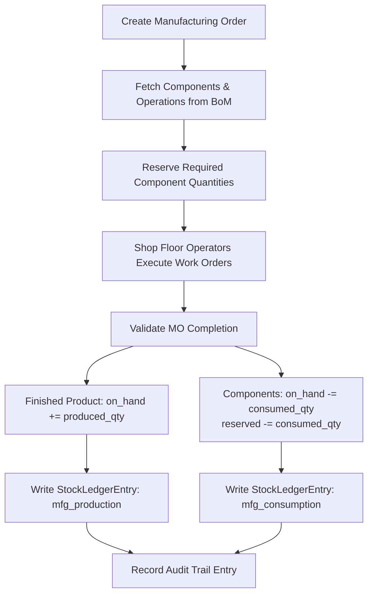
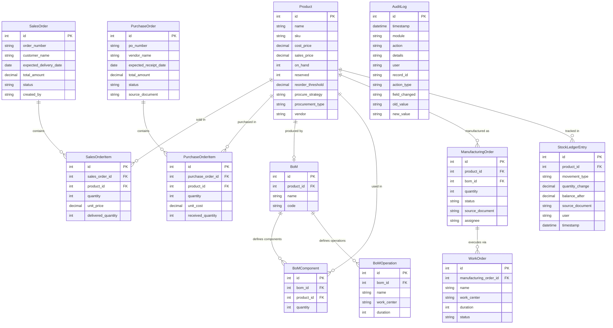

# Mini ERP — From Demand to Delivery

> A full-stack Enterprise Resource Planning (ERP) system built with **Django** and **Vanilla JS**, covering the complete business cycle from customer sales orders through procurement, manufacturing, inventory movement, and final delivery — backed by a real-time audit log.

---

## Table of Contents

1. [Project Overview](#project-overview)
2. [Tech Stack](#tech-stack)
3. [Project Structure](#project-structure)
4. [Core ERP Modules](#core-erp-modules)
   - [Executive Dashboard](#1-executive-dashboard)
   - [Product Catalog](#2-product-catalog)
   - [Sales Orders](#3-sales-orders)
   - [Purchase Orders](#4-purchase-orders)
   - [Manufacturing & Bill of Materials](#5-manufacturing--bill-of-materials)
   - [Inventory & Stock Ledger](#6-inventory--stock-ledger)
   - [Audit Trail & Traceability](#7-audit-trail--traceability)
5. [Workflow Diagrams](#workflow-diagrams)
   - [Master Business Workflow](#master-business-workflow)
   - [Sales Confirmation & Shortage Resolution Flow](#sales-confirmation--shortage-resolution-flow)
   - [Manufacturing & Component Consumption Flow](#manufacturing--component-consumption-flow)
6. [Automation Engines](#automation-engines)
   - [Make To Order (MTO) Engine](#make-to-order-mto-engine)
   - [Make To Stock (MTS) Engine](#make-to-stock-mts-engine)
7. [Role-Based Access Control](#role-based-access-control)
8. [Database Schema](#database-schema)
9. [Setup & Installation](#setup--installation)

---

## Project Overview

Mini ERP is a custom-built Enterprise Resource Planning system designed to manage the operational lifecycle of a manufacturing or trading business (demonstrated through the business scenario of **Shiv Furniture Works**). It replicates core commercial ERP functionality in a lightweight, production-grade Django architecture.

### Core Business Cycle

```
Customer Order -> Stock Availability Check -> Confirm & Reserve Stock -> Deliver Order
                      | (if out of stock / shortage)
                      v
      Trigger Manufacturing Order or Purchase Order
                      |
            Receive Goods / Produce Items
                      |
      Inventory Ledger Updated -> Deliver to Customer
```

Every single action across all modules is automatically recorded in a centralized **Audit Log** with timestamps, user details, and change histories.

### Inventory Control Formula

To prevent overselling, the system enforces a clear distinction between physical stock and available stock:

```
Free To Use Quantity = On Hand Quantity - Reserved Quantity
```

- **On Hand Quantity**: Physical count of items currently in the warehouse.
- **Reserved Quantity**: Units committed to confirmed Sales Orders or Manufacturing Orders.
- **Free To Use Quantity**: Uncommitted stock available for new customer orders.

---

## Tech Stack

| Layer | Technology | Description |
|---|---|---|
| **Backend** | Python 3.10+ / Django 6.x | Core application logic, REST endpoints, ORM, and workflow management |
| **Database** | SQLite | Relational database storage (configurable for PostgreSQL/MySQL) |
| **Frontend** | Vanilla HTML5 / CSS3 / JavaScript | Modern dashboard UI, dynamic modals, and interactive drawers |
| **Data Visualization** | Chart.js | Real-time dashboard analytics charts |
| **Authentication & RBAC** | Session-based Role Switcher | Multi-role access control and permission simulation |
| **Timezone System** | Asia/Kolkata (IST) | Standardized timestamping across ledger entries and audit logs |

---

## Project Structure

```
odoo/
├── mini_erp/               # Django project core configuration
│   ├── settings.py         # Application settings, timezone (IST), static setup
│   └── urls.py             # Master URL router
│
├── core/                   # Dashboard analytics, RBAC permissions, audit logger
│   ├── views.py            # Dashboard metrics calculation and MTS engine logic
│   ├── utils.py            # Role access mapping, audit logger, stock recalculations
│   └── context_processors.py
│
├── products/               # Master product catalog
│   ├── models.py           # Product model (on_hand, reserved, reorder_threshold, strategy)
│   └── views.py            # Product CRUD and stock adjustment actions
│
├── sales/                  # Sales order lifecycle
│   ├── models.py           # SalesOrder, SalesOrderItem
│   └── views.py            # Create, Confirm (stock check/reserve), Deliver, Cancel
│
├── purchases/              # Purchase order lifecycle
│   ├── models.py           # PurchaseOrder, PurchaseOrderItem
│   └── views.py            # Create, Confirm, Receive (replenish stock), Cancel
│
├── manufacturing/          # Production and assembly management
│   ├── models.py           # BoM, BoMComponent, BoMOperation, ManufacturingOrder, WorkOrder
│   └── views.py            # MO creation, Work Order execution, Completion stock logic
│
├── inventory/              # Double-entry inventory tracking
│   ├── models.py           # StockLedgerEntry (immutable movement log)
│   └── views.py            # Stock valuation ledger and movement log
│
├── audit/                  # Audit trail and user notifications
│   ├── models.py           # AuditLog, Notification
│   └── views.py            # Audit log browser and notification endpoints
│
├── templates/              # HTML layout templates
│   ├── base.html           # Shared layout header, sidebar, toast, and role switcher
│   ├── dashboard.html      # Real-time analytics dashboard
│   ├── sales_pipeline.html # Sales order pipeline and delivery drawer
│   ├── purchase_list.html  # Purchase order management and receipt drawer
│   ├── manufacturing_cockpit.html  # Production management cockpit and Work Orders
│   ├── bom_list.html       # Bill of Materials management
│   ├── products_list.html  # Product catalog and stock level management
│   ├── stock_ledger.html   # Stock valuation and movement ledger
│   └── audit_logs.html     # System audit logs
│
└── static/
    └── style.css           # Central stylesheet and component design system
```

---

## Core ERP Modules

### 1. Executive Dashboard

The central dashboard provides real-time operational visibility across all departments.

#### Key Performance Indicators (KPIs)

- **Gross Revenue**: Sum of all non-cancelled Sales Orders.
- **Pending Deliveries**: Confirmed Sales Orders awaiting full delivery.
- **Active Production**: Manufacturing Orders currently in progress.
- **Inventory Valuation**: Total cost value of warehouse stock on hand (`SUM(on_hand * cost_price)`).
- **Stock Shortages**: Count of products where `free_to_use < reorder_threshold`.
- **Replenishment Queue**: Active Purchase Orders currently in transit.
- **Delayed Orders**: Sales Orders past their expected delivery date.
- **Fulfilment Rate**: Percentage of sales orders successfully delivered.

---

### 2. Product Catalog

The product catalog serves as master data referenced across all operational workflows.

#### Product Attributes

| Field | Description |
|---|---|
| `name` / `sku` | Unique identifier and product name |
| `cost_price` / `sales_price` | Financial valuation and default order pricing |
| `on_hand` | Physical count in the warehouse |
| `reserved` | Allocated stock committed to open orders |
| `free_to_use` | Computed property (`on_hand - reserved`) |
| `reorder_threshold` | Threshold line triggering stock shortage alerts |
| `procure_strategy` | Strategy type: `MTS` (Make To Stock) or `MTO` (Make To Order) |
| `procurement_type` | Replenishment type: `Purchase` (from vendor) or `Manufacturing` (via BoM) |
| `vendor` | Default supplier for purchase orders |
| `bom` | Linked Bill of Materials for manufactured products |

---

### 3. Sales Orders

Manages the customer order lifecycle from draft creation to order delivery.

#### Status Lifecycle



#### Order Business Logic

- **Drafting**: Create order lines with products, quantities, and prices.
- **Confirmation**:
  - The system evaluates available stock (`free_to_use`).
  - If stock is sufficient, the order status changes to `Confirmed` and stock is moved to `Reserved`.
  - If stock is insufficient, the system presents a **Shortage Modal** with recommended replenishment actions (Purchase Order or Manufacturing Order).
- **Delivery**:
  - User validates quantities dispatched.
  - Physical `on_hand` decreases and `reserved` stock is released.
  - Movement is written to `StockLedgerEntry` under type `sales_delivery`.

---

### 4. Purchase Orders

Handles vendor purchasing and stock replenishment.

#### Status Lifecycle



#### Purchase Business Logic

- **Creation & Confirmation**: Generated manually or automatically by MTO/MTS engines.
- **Receiving Stock**:
  - User logs received item quantities.
  - Physical `on_hand` stock increases immediately.
  - Movement is recorded in `StockLedgerEntry` under type `purchase_receipt`.

---

### 5. Manufacturing & Bill of Materials

Converts raw material components into finished products through structured production steps.

#### Bill of Materials (BoM)
Defines the required inputs for a finished product:
- **Components**: Component product links and required quantities.
- **Operations**: Production steps, target work centers, and estimated durations.

#### Manufacturing Order (MO) Workflow

```
Create MO -> Reserve Components -> Execute Work Orders -> Complete MO
```

- **Reservation**: Upon MO confirmation, required raw material component quantities are locked (`component.reserved += needed_qty`).
- **Work Orders**: Production steps executed by operators at specific Work Centers.
- **Completion**:
  - Raw material `on_hand` and `reserved` quantities are deducted (consumed).
  - Finished product `on_hand` is increased (produced).
  - Dual ledger entries are created (`mfg_consumption` and `mfg_production`).

---

### 6. Inventory & Stock Ledger

The stock ledger is the single source of truth for all inventory movements.

- **Immutability**: Every stock change creates an append-only `StockLedgerEntry`.
- **Traceability**: Each entry links to the source document (`SO-XXX`, `PO-XXX`, `MO-XXX`), movement type, user, timestamp, quantity delta, and updated running balance.

---

### 7. Audit Trail & Traceability

- **System Audit Log**: Every database mutation records an `AuditLog` entry tracking the module, action type, user, record ID, old value, and new value.
- **Document Lineage**: Full tracing links related documents together (e.g., Sales Order `SO-001` -> Manufacturing Order `MO-001` -> Purchase Order `PO-001`).

---

## Workflow Diagrams

### Master Business Workflow



### Sales Confirmation & Shortage Resolution Flow



### Manufacturing & Component Consumption Flow



---

## Automation Engines

### Make To Order (MTO) Engine
Triggered when a Sales Order is confirmed with insufficient stock for products marked as `MTO`:
1. If the item procurement type is `Purchase`, the system automatically generates and confirms a Purchase Order for the shortage.
2. If the item procurement type is `Manufacturing`, the system creates a Manufacturing Order.
3. If raw material components required for the Manufacturing Order are also out of stock, the engine recursively generates Purchase Orders for those missing raw materials.

### Make To Stock (MTS) Engine
Monitors warehouse levels for products marked as `MTS`:
- Scans all products where `free_to_use < reorder_threshold`.
- Automatically calculates deficit quantities and triggers replenishment Purchase Orders or Manufacturing Orders to maintain stock safety margins.

---

## Role-Based Access Control

The system implements session-based role switching to simulate multi-user access permissions without authentication overhead.

| Role | Access Description | Accessible Views |
|---|---|---|
| **Admin** | Full system administration and audit access | All pages (Dashboard, Products, Sales, Purchases, Manufacturing, BoMs, Inventory, Audit Logs) |
| **Business Owner** | Executive read-only oversight | All operational pages (Read-only view; no audit log configuration) |
| **Sales User** | Customer demand management | Dashboard, Product Catalog, Sales Orders |
| **Purchase User** | Vendor replenishment management | Dashboard, Product Catalog, Purchase Orders |
| **Manufacturing User** | Shop floor and assembly management | Dashboard, Manufacturing Cockpit, Bill of Materials |
| **Inventory Manager** | Warehouse and stock ledger management | Dashboard, Product Catalog, Stock Ledger, Movements |

---

## Database Schema



---

## Setup & Installation

### Prerequisites

- Python 3.10+
- pip
- Git

### Installation Steps

1. **Clone the repository**
   ```bash
   git clone https://github.com/Adgu0205/procurERP.git
   cd procurERP
   ```

2. **Create and activate virtual environment**
   - macOS / Linux:
     ```bash
     python3 -m venv venv
     source venv/bin/activate
     ```
   - Windows:
     ```cmd
     python -m venv venv
     venv\Scripts\activate
     ```

3. **Install dependencies**
   ```bash
   pip install django
   ```

4. **Apply database migrations**
   ```bash
   python manage.py migrate
   ```

5. **Seed initial demo data (Optional)**
   ```bash
   python seed.py
   ```

6. **Start the development server**
   ```bash
   python manage.py runserver 8000
   ```

7. **Access the application**
   Open browser at: `http://127.0.0.1:8000/`

---

### Role Switching

No authentication login is required. Use the **Active Role** dropdown in the top navigation bar to switch between user roles and test different access permissions.
