# 🏭 Mini ERP — From Demand to Delivery

> A full-stack, production-grade Enterprise Resource Planning system built with **Django** and **Vanilla JS**, covering the complete business cycle from customer sales orders all the way through procurement, manufacturing, and inventory — with a real-time audit trail throughout.

---

## 📋 Table of Contents

1. [Project Overview](#project-overview)
2. [Tech Stack](#tech-stack)
3. [Project Structure](#project-structure)
4. [Modules](#modules)
   - [Dashboard](#1-dashboard)
   - [Products](#2-products--catalog)
   - [Sales Orders](#3-sales-orders)
   - [Purchase Orders](#4-purchase-orders)
   - [Manufacturing](#5-manufacturing-orders--bill-of-materials)
   - [Inventory & Ledger](#6-inventory--stock-ledger)
   - [Audit Logs](#7-audit-logs)
5. [Full Business Workflow](#full-business-workflow)
6. [Role-Based Access Control](#role-based-access-control)
7. [Database Schema](#database-schema)
8. [Setup & Installation](#setup--installation)
9. [Key Design Decisions](#key-design-decisions)

---

## Project Overview

Mini ERP is a **custom-built Enterprise Resource Planning system** designed to manage the complete operational lifecycle of a small-to-medium manufacturing or trading business. It replicates the core modules of commercial ERP systems (like Odoo) in a clean, lightweight Django application.

### What it tracks end-to-end:

```
Customer Order → Stock Check → Confirm & Reserve → Deliver
                    ↓ (if shortage)
              Trigger Manufacturing Order or Purchase Order
                    ↓
              Receive Stock / Produce Goods
                    ↓
              Inventory Updated → Deliver to Customer
```

Every single action at every step is recorded in an **Audit Log** with the exact timestamp, user, and change made.

---

## Tech Stack

| Layer | Technology |
|---|---|
| **Backend** | Python 3.x · Django 6.x |
| **Database** | SQLite (development) |
| **Frontend** | Vanilla HTML + CSS + JavaScript |
| **Charts** | Chart.js (CDN) |
| **Session Auth** | Django session-based role switching |
| **Timezone** | Asia/Kolkata (IST) |

---

## Project Structure

```
odoo/
├── mini_erp/               # Django project settings & URL configuration
│   ├── settings.py         # App config, timezone (IST), static files
│   └── urls.py             # Master URL router for all modules
│
├── core/                   # Dashboard, role management, utilities
│   ├── views.py            # Dashboard KPI calculations & MTS engine
│   ├── utils.py            # Role access map, permissions, audit recorder
│   └── context_processors.py
│
├── products/               # Product catalog
│   ├── models.py           # Product (on_hand, reserved, reorder_threshold)
│   └── views.py            # CRUD for products
│
├── sales/                  # Sales order lifecycle
│   ├── models.py           # SalesOrder, SalesOrderItem
│   └── views.py            # Create, Confirm (with stock check), Deliver, Cancel
│
├── purchases/              # Purchase order lifecycle
│   ├── models.py           # PurchaseOrder, PurchaseOrderItem
│   └── views.py            # Create, Confirm, Receive (updates stock), Cancel
│
├── manufacturing/          # Production management
│   ├── models.py           # BoM, BoMComponent, BoMOperation, ManufacturingOrder, WorkOrder
│   └── views.py            # Create MO, Start, Complete (consumes/produces stock)
│
├── inventory/              # Stock ledger and movement tracking
│   ├── models.py           # StockLedgerEntry (every stock change logged here)
│   └── views.py            # Ledger view, Movements view, CSV export
│
├── audit/                  # System-wide audit trail
│   ├── models.py           # AuditLog, Notification
│   └── views.py            # Audit log browser, CSV export
│
├── templates/              # All HTML templates
│   ├── base.html           # Shared layout (sidebar, header, toast, notifications)
│   ├── dashboard.html      # Executive dashboard with KPI tiles & charts
│   ├── sales_pipeline.html # Sales Kanban/List + drawer detail + delivery modal
│   ├── purchase_list.html  # Purchase Kanban/List + receive modal
│   ├── manufacturing_cockpit.html  # MO management + work order timer
│   ├── bom_list.html       # Bill of Materials list + create modal
│   ├── products_list.html  # Product catalog with stock adjustment
│   ├── stock_ledger.html   # Chronological ledger of stock movements
│   ├── inventory_movements.html    # Filterable inventory movement log
│   └── audit_logs.html     # Full audit trail table with filters
│
└── static/
    └── style.css           # Full design system (dark theme, components)
```

---

## Modules

### 1. Dashboard

The **Executive Dashboard** is the central command center showing the health of the entire business at a glance.

#### KPI Tiles (Row 1 — Primary)

| Tile | What it shows | How it's calculated |
|---|---|---|
| **Gross Revenue** | Total ₹ value of all active sales | `SUM(total_amount)` of all non-cancelled SOs |
| **Pending Deliveries** | Orders waiting to be shipped | SOs with status `confirmed` or `partially_delivered` |
| **Active Production** | Manufacturing orders in progress | MOs with status `confirmed`, `in_progress`, or `quality_check` |
| **Inventory Value** | Total cost of all stock on hand | `SUM(on_hand × cost_price)` across all products |

#### KPI Tiles (Row 2 — Operational)

| Tile | What it shows | How it's calculated |
|---|---|---|
| **Stock Shortages** | Products below their reorder threshold | Products where `free_to_use < reorder_threshold` |
| **Replenishment Queue** | Active purchase orders in transit | POs with status `confirmed` or `partially_received` |
| **Delayed Orders** | Orders past their delivery date | SOs with `expected_delivery_date < today` and still open |
| **Fulfilment Rate** | % of orders fully delivered | `(fully_delivered / total_non_cancelled) × 100` |

#### Smart Recommendations Panel

Automatically generates insights from the live data:
- Which products need urgent restocking (sorted by deficit severity)
- MTO queue depth analysis
- Delivery overdue rate
- Manufacturing throughput vs 75% benchmark

#### Quick Actions

- **Create Sales Order** — jumps directly to the SO creation modal
- **Run MTS Reorder Rules** — scans all MTS products and auto-creates POs or MOs for anything below threshold
- **View Ledger Logs** — opens the Stock Valuation Ledger
- **Inventory Movements** — opens the detailed movement history

---

### 2. Products / Catalog

The product catalog is the **central master data record** that every other module references.

#### Key Fields

| Field | Purpose |
|---|---|
| `name` / `sku` | Product identity |
| `cost_price` / `sales_price` | Used for valuation and SO pricing |
| `on_hand` | Current physical quantity in the warehouse |
| `reserved` | Quantity committed to confirmed sales orders |
| `free_to_use` | `on_hand − reserved` — what's actually available |
| `reorder_threshold` | When `free_to_use` drops below this, status = Low Stock |
| `procure_strategy` | MTS (Make To Stock) or MTO (Make To Order) |
| `procurement_type` | Manufacturing (has a BoM) or Purchase (from a vendor) |
| `vendor` | Default vendor name for purchase-type products |

#### Stock Status Logic

```
if free_to_use < reorder_threshold  →  status = "Low Stock"
else                                 →  status = "Active"
```

#### Workflow Diagram

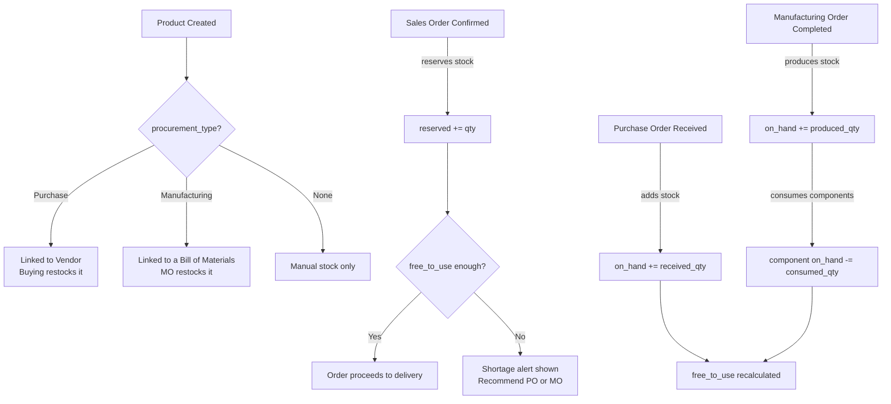

---

### 3. Sales Orders

Manages the entire **customer-facing order lifecycle** from initial quote to final delivery.

#### Status Lifecycle

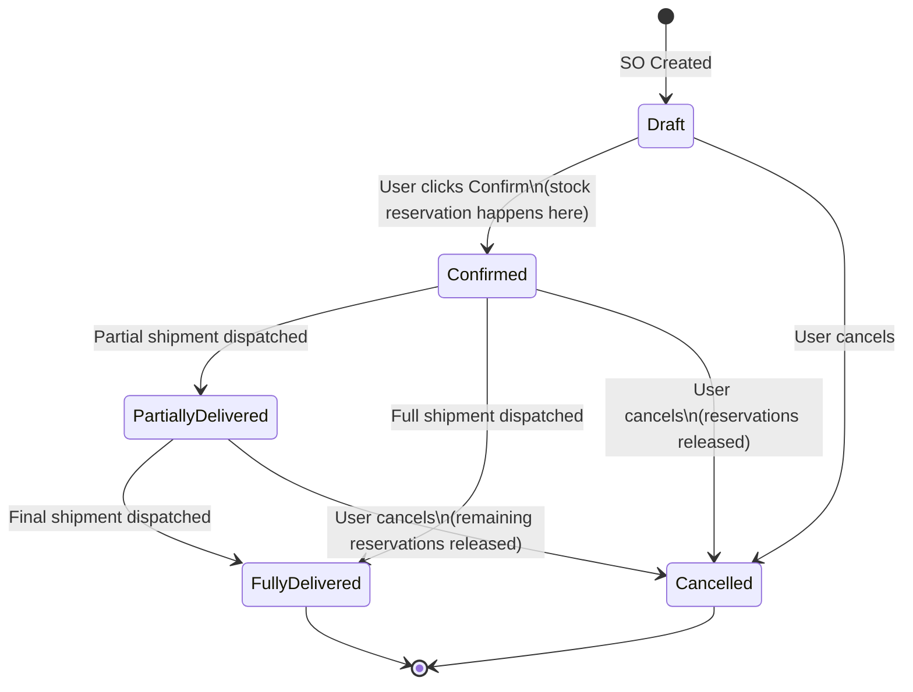

#### Confirm Flow (with Stock Intelligence)

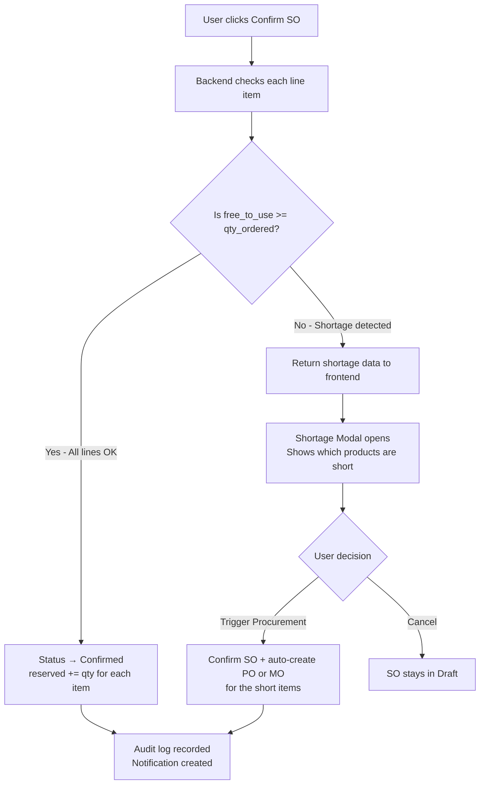

#### Delivery Flow

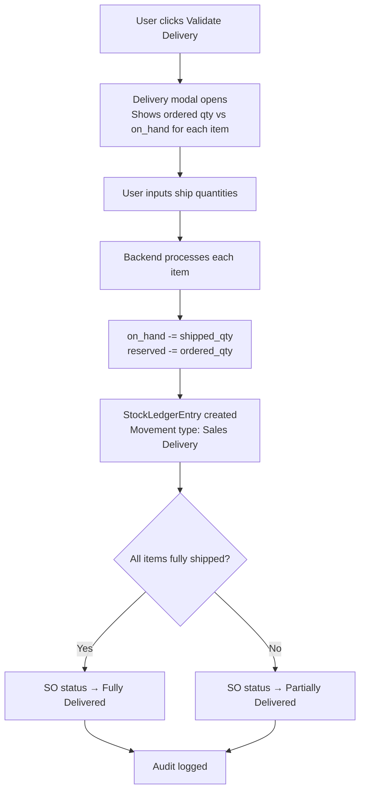

#### Key Document Reference
- Each SO gets an Odoo-style reference: **SO-001**, **SO-002**, etc.
- Linked items: `SalesOrder` → `SalesOrderItem` → `Product`

---

### 4. Purchase Orders

Manages the **vendor procurement cycle** — buying stock to replenish inventory.

#### Status Lifecycle

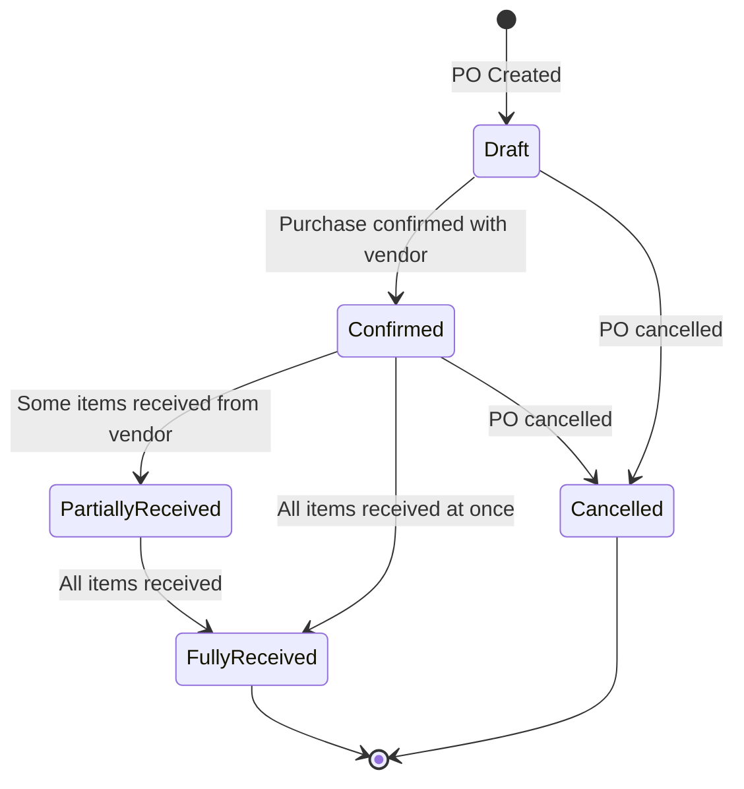

#### Receive Goods Flow (Stock Impact)

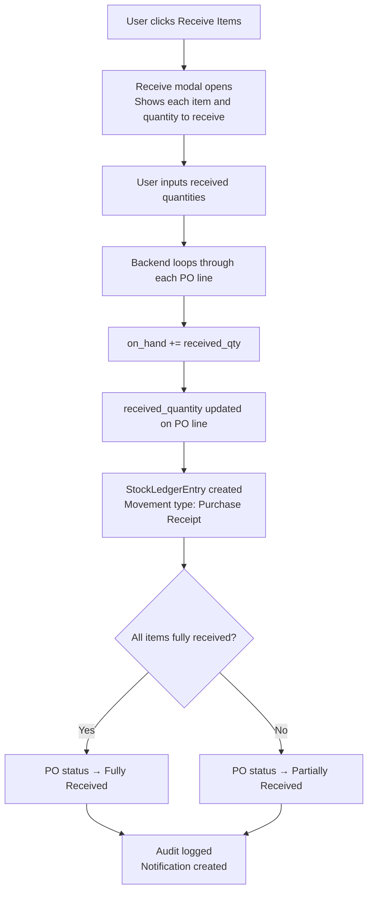

#### Key Document Reference
- Each PO gets a reference: **PO-001**, **PO-002**, etc.
- Linked items: `PurchaseOrder` → `PurchaseOrderItem` → `Product`

---

### 5. Manufacturing Orders & Bill of Materials

The most complex module. It handles **transforming raw materials into finished goods**.

#### Bill of Materials (BoM)

A BoM is a **recipe** — it defines exactly what raw materials (and in what quantities) are needed to produce one finished product.

```
BoM: Wooden Dining Table  (BOM-000001, v1.0)
├── Produces: 1x Dining Table
├── Components:
│   ├── 4x Wood Plank
│   ├── 16x Steel Screw
│   └── 1x Varnish Coat
└── Operations:
    ├── Assembly (Work Center: Assembly Bay, 120 mins)
    └── Finishing (Work Center: Paint Shop, 45 mins)
```

#### Manufacturing Order Lifecycle

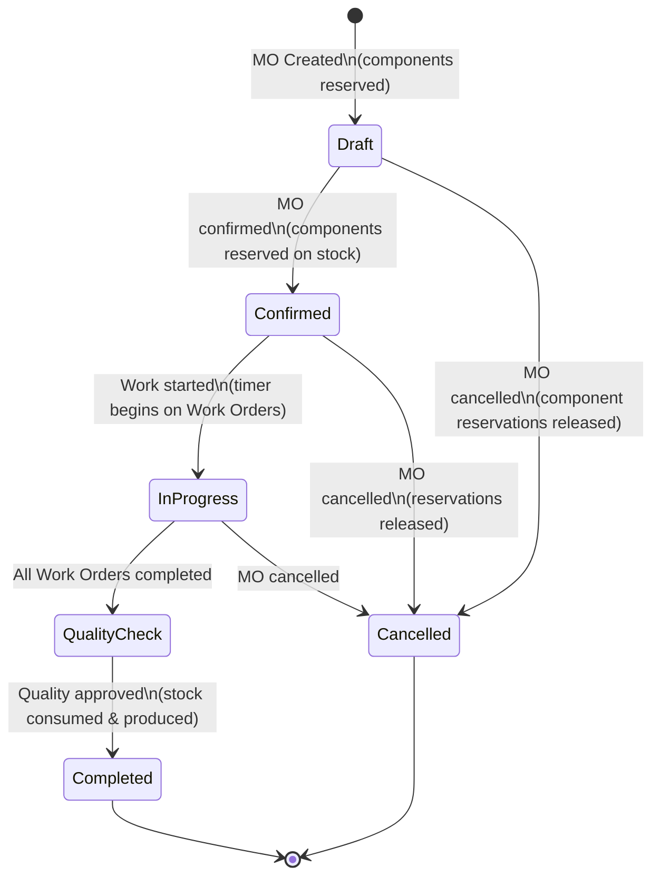

#### Complete MO Flow (Stock Impact)

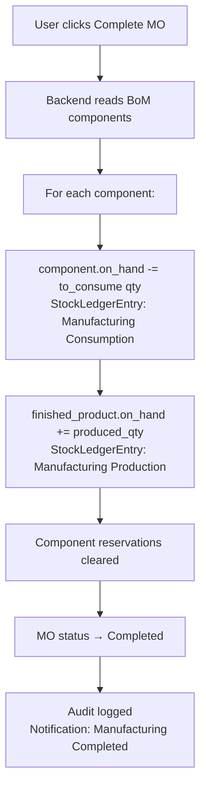

#### Work Orders

Each operation in a BoM generates a **Work Order** when a Manufacturing Order is created. Work Orders track the actual time spent on each operation step.

```
Manufacturing Order: MO-0001 (Produce 10x Dining Table)
├── Work Order 1: Assembly — Assembly Bay (Est. 120 mins)
│   └── [Start Timer] → [Complete] → actual_duration logged
└── Work Order 2: Finishing — Paint Shop (Est. 45 mins)
    └── [Start Timer] → [Complete] → actual_duration logged
```

#### MTO (Make To Order) Flow

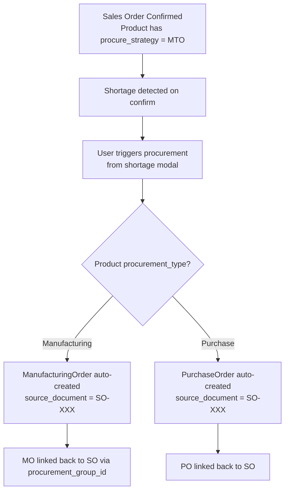

---

### 6. Inventory & Stock Ledger

Every single stock movement in the system is **automatically recorded** in the `StockLedgerEntry` table, creating a permanent, chronological ledger.

#### Movement Types

| Movement Type | When Created | Qty Change |
|---|---|---|
| **Sales Delivery** | When SO items are shipped to customer | ➖ Negative (stock out) |
| **Purchase Receipt** | When PO items are received from vendor | ➕ Positive (stock in) |
| **Manufacturing Consumption** | When MO completes — raw materials used | ➖ Negative (stock out) |
| **Manufacturing Production** | When MO completes — finished goods created | ➕ Positive (stock in) |
| **Manual Adjustment** | Admin corrects stock count directly | ± Either direction |

#### Ledger Entry Structure

```
Timestamp        | Product       | Movement Type         | Qty Change | Balance After | Source Doc | User
-----------------+---------------+-----------------------+------------+---------------+------------+------
2026-06-14 08:30 | Wooden Table  | Sales Delivery        | -5         | 18            | SO-003     | Admin
2026-06-13 17:00 | Wooden Table  | Purchase Receipt      | +20        | 23            | PO-002     | Admin
2026-06-13 09:00 | Wood Plank    | Manufacturing Consumption | -40     | 60            | MO-0002    | Admin
2026-06-13 09:00 | Dining Table  | Manufacturing Production   | +10     | 10            | MO-0002    | Admin
```

#### Stock Formula (always real-time)

```
free_to_use = on_hand - reserved

on_hand     ← incremented by: Purchase Receipt, Manufacturing Production, Manual Adjustment (+)
on_hand     ← decremented by: Sales Delivery, Manufacturing Consumption, Manual Adjustment (-)
reserved    ← incremented by: Sales Order Confirmed
reserved    ← decremented by: Sales Order Delivered / Cancelled
```

---

### 7. Audit Logs

A **tamper-proof system-wide activity journal** that records every significant action performed by any user.

#### What Gets Logged

| Module | Events Logged |
|---|---|
| **Sales** | Order Created, Confirmed, Delivered (partial/full), Cancelled, Edited |
| **Purchases** | Order Created, Confirmed, Items Received, Cancelled, Edited |
| **Manufacturing** | MO Created, Started, Completed, Cancelled; Work Orders Started/Completed |
| **Products** | Product Created, Edited |
| **Inventory** | Manual Stock Adjustments |
| **System** | Role switches (user login events) |

#### Audit Log Entry Fields

```
timestamp     — Exact date & time in IST (Asia/Kolkata)
module        — Which part of the system (Sales, Manufacturing, etc.)
action        — What happened (Order Created, Stock Movement, etc.)
details       — Full human-readable description
user          — Who performed the action (role name)
record_id     — Document reference (e.g. SO-003, PO-001)
record_type   — Type of record (SalesOrder, Product, etc.)
action_type   — Create / Update / Delete
field_changed — Which field was changed (on edits)
old_value     — Value before the change
new_value     — Value after the change
```

---

## Full Business Workflow

The complete end-to-end flow of a business transaction — from customer demand to final delivery:

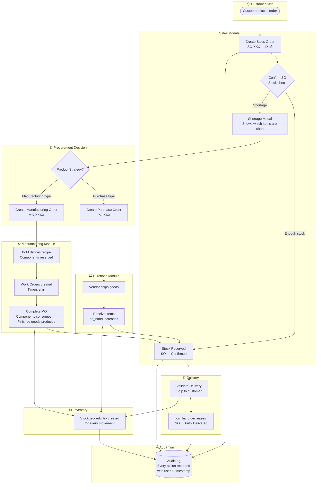

---

## Role-Based Access Control

The system uses a **session-based role switcher** to simulate different user roles. Each role has a specific set of pages they can access.

| Role | Full Name | Pages Accessible |
|---|---|---|
| `admin` | Admin User | All pages (Dashboard, Products, Sales, Purchases, Manufacturing, BoM, Audit Logs, Inventory, Ledger) |
| `business_owner` | Shiv (CEO) | All pages except Audit Logs (read-only on Sales/Purchases/Manufacturing) |
| `sales_user` | Sales Representative | Dashboard, Products, Sales Orders |
| `purchase_user` | Procurement Manager | Dashboard, Products, Purchase Orders |
| `manufacturing_user` | Shop Floor Operator | Dashboard, Manufacturing, Bills of Material |
| `inventory_manager` | Stockroom Controller | Dashboard, Products, Inventory, Ledger, Movements |

#### Permission Matrix

```
Permission              │ admin │ business_owner │ sales_user │ purchase_user │ mfg_user │ inv_manager
─────────────────────────┼───────┼────────────────┼────────────┼───────────────┼──────────┼─────────────
can_edit_products       │  ✓   │       ✗        │     ✗      │      ✗        │    ✗     │     ✓
can_edit_sales          │  ✓   │       ✗*       │     ✓      │      ✗        │    ✗     │     ✗
can_edit_purchases      │  ✓   │       ✗*       │     ✗      │      ✓        │    ✗     │     ✗
can_edit_manufacturing  │  ✓   │       ✗*       │     ✗      │      ✗        │    ✓     │     ✗
can_edit_bom            │  ✓   │       ✗*       │     ✗      │      ✗        │    ✓     │     ✗
can_adjust_inventory    │  ✓   │       ✗        │     ✗      │      ✗        │    ✗     │     ✓
can_view_audit_logs     │  ✓   │       ✗        │     ✗      │      ✗        │    ✗     │     ✗

* business_owner = is_read_only = True (can view all, cannot create/edit/delete)
```

---

## Database Schema

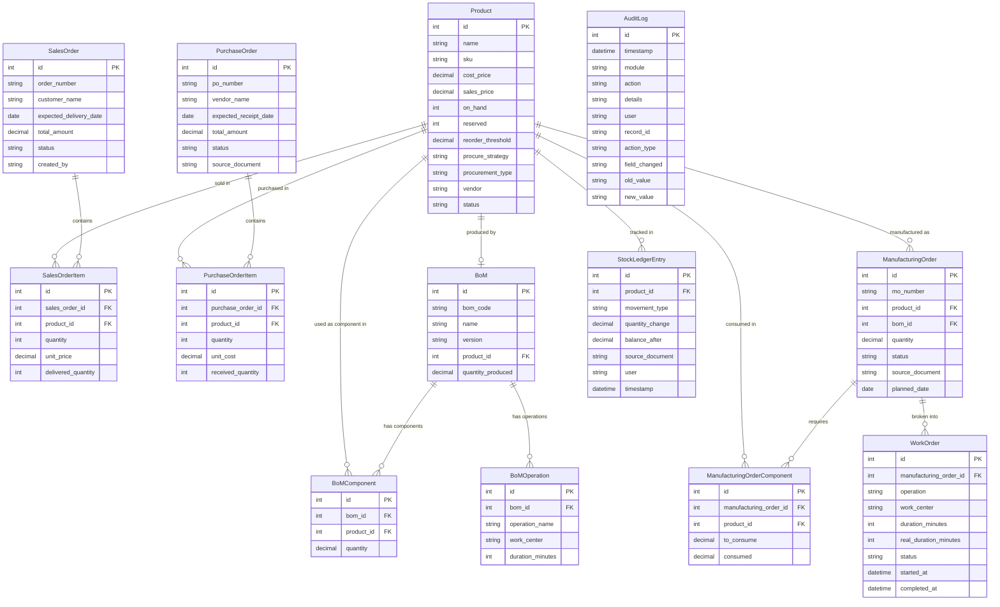

---

## Setup & Installation

### Prerequisites

- Python 3.10+
- pip
- Git

### Steps

```bash
# 1. Clone the repository
git clone https://github.com/Adgu0205/miniERP-.git
cd miniERP-

# 2. Create and activate a virtual environment
python -m venv venv
source venv/bin/activate        # Mac/Linux
venv\Scripts\activate           # Windows

# 3. Install dependencies
pip install django

# 4. Apply database migrations
python manage.py migrate

# 5. (Optional) Seed sample data
python seed.py

# 6. Start the development server
python manage.py runserver 8000
```

Then open your browser and go to: **http://127.0.0.1:8000/**

### Default Login

No authentication is required. Use the **Active Role** dropdown in the top-right corner to switch between roles and test different permission levels.

---

## Key Design Decisions

### 1. Session-Based Role System (No Django Auth)
Instead of Django's built-in user authentication, the system uses session variables (`current_role`, `current_user`) to simulate different roles. This makes it easy to demo and test all role behaviors without creating separate user accounts.

### 2. Stock Ledger as Single Source of Truth
Every stock movement — whether from sales, purchases, manufacturing, or manual adjustments — writes to the `StockLedgerEntry` table. This ensures full traceability and the ability to reconstruct stock history at any point in time.

### 3. Free-to-Use vs On-Hand
The system distinguishes between:
- `on_hand`: Physical count of units in the warehouse
- `reserved`: Units committed to confirmed but undelivered sales orders
- `free_to_use = on_hand − reserved`: What can actually be allocated to new orders

This prevents overselling — you can never promise the same unit to two different customers.

### 4. Shortage Modal with Smart Recommendations
Rather than silently blocking a sales order when stock is insufficient, the system presents the user with a **shortage modal** that explains which products are short, by how much, and then allows the user to simultaneously confirm the order AND trigger a procurement action (create PO or MO) in a single click.

### 5. IST Timestamps
All timestamps are stored and displayed in **Indian Standard Time (IST, UTC+5:30)** using Django's `TIME_ZONE = 'Asia/Kolkata'` setting and `USE_TZ = True`.

### 6. MTS Reordering Engine
The dashboard includes an automated **Make-To-Stock reordering engine** that, when triggered, scans all MTS-strategy products and automatically creates Purchase Orders or Manufacturing Orders for any product that has fallen below its reorder threshold — mimicking ERP reorder rule automation.

---

## Branch Information

| Branch | Purpose |
|---|---|
| `aditya` | Main development branch |

---

*Built as a demonstration of full-stack ERP development — covering database design, business logic, inventory accounting, and multi-role access control.*
